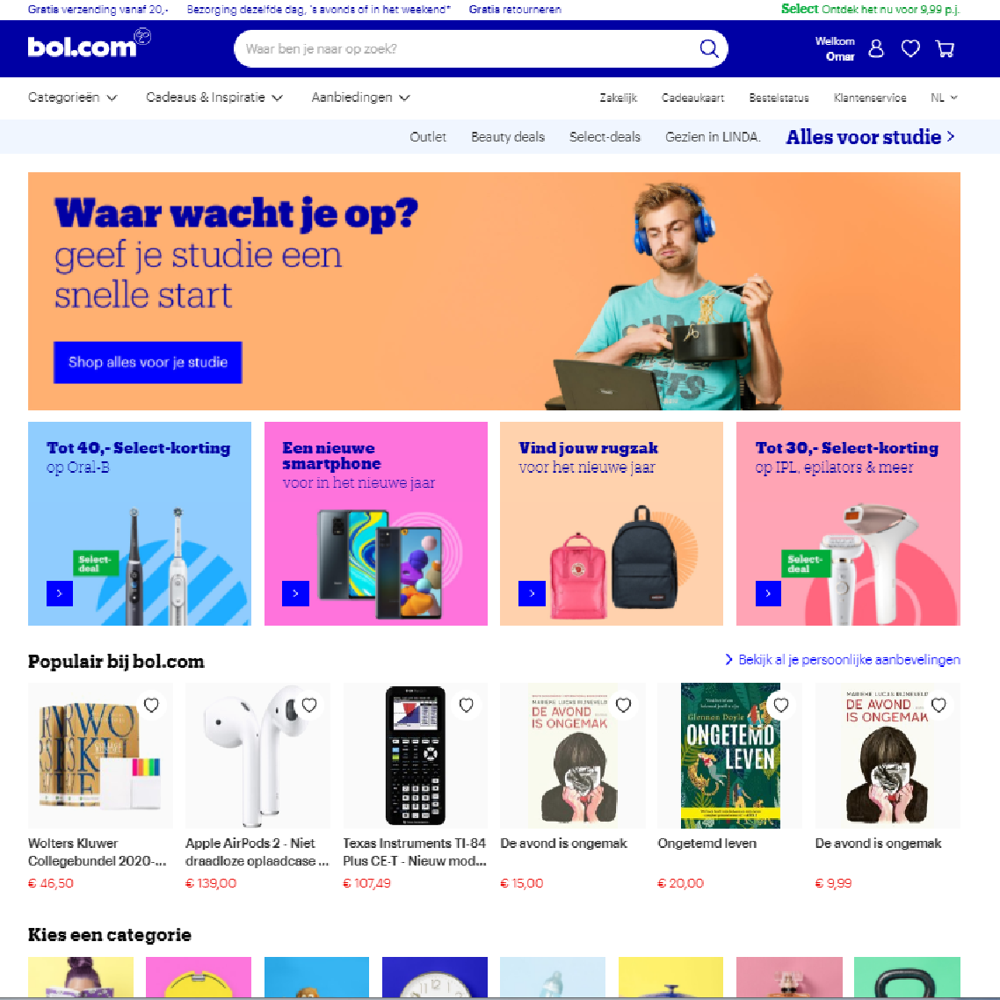
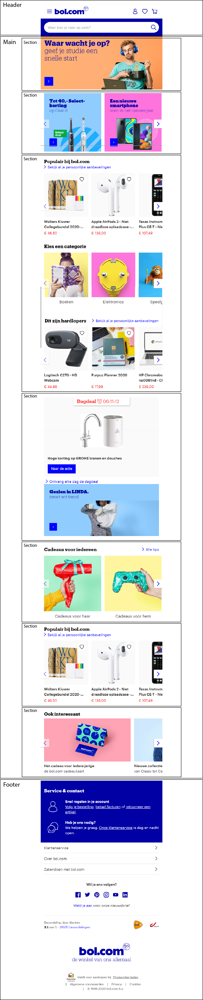

# Procesverslag
Auteur: Omar Khalifa

Markdown cheat cheet: [Hulp bij het schrijven van Markdown](https://github.com/adam-p/markdown-here/wiki/Markdown-Cheatsheet). Nb. de standaardstructuur en de spartaanse opmaak zijn helemaal prima. Het gaat om de inhoud van je procesverslag. Besteedt de tijd voor pracht en praal aan je website.

## Bronnenlijst
1. -bron 1-
2. -bron 2-
3. -...-

## Eindgesprek (week 7/8)

Ik heb moeite met geen classes gebruiken. Daarom heb ik in eerste instantie alles met classes gedaan. Toen mijn website (in mijn ogen) redelijk compleet was heb ik geprobeerd om deze classes om te zetten in child elementen. Dit ging (zoals ik had moeten weten) lastiger dan verwacht. Dit is ook een reden dat er nu veel classes in mijn bestand staan.
Het zelfde heb ik gedaan met px werken ipv met em. Op de 1 of andere manier leek het me een goed idee om hiermee te beginnen en het daarna om te zetten. Dit is "natuurlijk" een onmogelijk opgave (voor mij).

**Screenshot(s):**

-screenshot(s) van je eindresultaat-
(images/screenshots/index.png)
(images/screenshots/product.png)
(../images/screenshots/index.png)
(../images/screenshots/product.png)

## Voortgang 3 (week 6)

Ik ben niet bij deze voorgangsgesprekken geweest omdat mijn laptop in deze periode (3okt-12okt).
Hierdoor heb ik niet alleen een goede achterstand opgelopen maar ben ik ook mijn bestanden verloren (omdat deze sukkel geen backups maakt).

In de herfst vakantie heb ik code lopen beuken. Dit verliep soms soepeltjes en soms dramatisch. Het bedenken hoe code geschreven moet worden gaat goed maar het uitvoeren blijft lastig.

## Voortgang 2 (week 5)

-Zie Voorgang 3

## Voortgang 1 (week 3)

### Stand van zaken

Ik heb voornamelijk problemen met het schrijven van code. De denkwijze begrijp ik wel maar om mijn ideeën om te zetten in code vind ik nog erg lastig.

Op het moment is mijn website nog niet ver. Dit komt deels omdat ik mijn laptop een week kwijt ben geweest vanwege een kapot beeldscherm. Daarnaast had ik last van het bovenstaande probleem.

**Screenshot(s):**

-screenshot(s) van hoe ver je bent-

### Agenda voor meeting

-samen met je groepje opstellen-

### Verslag van meeting

Ik moet een tandje bijzetten. Op deze manier ga ik het niet halen. Daarom is het belangrijk dat ik zeker 1 pagina af heb en al een begin heb gemaakt aan mijn 2e pagina.

## Intake (week 1)

**Je startniveau:** Blauw!

**Je focus:** helemaal responsive

**Je opdracht:** bol.com

**Screenshot(s):**

**Breakdown-schets(en):**

Ik krijg niet al de afbeeldingen goed in dit bestand dus doe het even zo.

